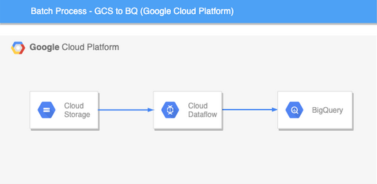

# BigDataScalaTraining
# Amazon US Customer Reviews Dataset

<hr style=\"border:0.5px solid gray\"> </hr>

## Data
Amazon Customer Reviews (a.k.a. Product Reviews) is one of Amazon’s iconic products. In a period of over two decades since the first review in 1995, millions of Amazon customers have contributed over a hundred million reviews to express opinions and describe their experiences regarding products on the Amazon.com website. The dataset used in this project is a subset of 11.6 GB from the original 54.41 GB worth of customer reviews.<br>

Dataset rows				:  23,483,067 <br>
Dataset columns: 		: 15 <br>
Dataset size				: 11.6 GB <br>
Original Dataset link				: https://www.kaggle.com/datasets/cynthiarempel/amazon-us-customer-reviews-dataset
<hr style=\"border:0.5px solid gray\"> </hr>

## Data Description


| S.No |	Name |	Description |
|-------|------|--------------|
|1  |marketplace	|2 letter country code of the marketplace where the review was written.
|2	|customer_id	|Random identifier that can be used to aggregate reviews written by a single author.
|3	|review_id	|The unique ID of the review.
|4	|product_id	|The unique Product ID the review pertains to. In the multilingual dataset the reviews for the same product in different countries can be grouped by the same product_id. 
|5	|product_parent	|Random identifier that can be used to aggregate reviews for the same product.
|6	|product_title	|Title of the product.
|7	|product_category	|Broad product category that can be used to group reviews. (also used to group the dataset into coherent parts). 
|8	|star_rating	|The 1-5 star rating of the review.
|9	|helpful_votes	|Number of helpful votes.
|10	|total_votes	|Number of total votes the review received.
|11	|vine	|Review was written as part of the Vine program.
|12	|verified_purchase	|The review is on a verified purchase.
|13	|review_headline	|The title of the review.
|14	|review_body	|The review text.
|15	|review_date	|The date the review was written.

<hr style=\"border:0.5px solid gray\"> </hr>

## Exploratory Data Analysis Performed using Spark
### Reading the data
The SparkSession configuration was set to run on local for this project, making sure to use all of the available cpu cores.

```scala
    val spark = SparkSession.builder()
      .appName("Amazon Dataset Exploration")
      .master("local[*]")
      .getOrCreate()
```

A specific schema was defined in order to avoid Spark incurring in processing time by infering the schema of the data. Also a case class was created to parse the DataFrame as DataSet.
```scala
  case class Review(marketplace: String, customer_id: Int, review_id: String, product_id: String, product_parent: Int,
                    product_title: String, product_category: String, star_rating: String, helpful_votes: Int, total_votes: Int,
                    vine: String, verified_purchase: String, review_headline: String, review_body: String, review_date: Date)
```

```scala
    val reviewSchema = new StructType()
      .add("marketplace", StringType, nullable = true)
      .add("customer_id", IntegerType, nullable = true)
      .add("review_id", StringType, nullable = true)
      .add("product_id", StringType, nullable = true)
      .add("product_parent", IntegerType, nullable = true)
      .add("product_title", StringType, nullable = true)
      .add("product_category", StringType, nullable = true)
      .add("star_rating", StringType, nullable = true)
      .add("helpful_votes", IntegerType, nullable = true)
      .add("total_votes", IntegerType, nullable = true)
      .add("vine", StringType, nullable = true)
      .add("verified_purchase", StringType, nullable = true)
      .add("review_headline", StringType, nullable = true)
      .add("review_body", StringType, nullable = true)
      .add("review_date", DateType, nullable = true)
```

```scala
    import spark.implicits._
    val amazonDS = spark.read
      .option("header", "true")
      .option("delimiter", "\t")
      .schema(reviewSchema)
      .csv(project_path)
      .as[Review]
```

## Data cleansing

As a first sample, the "star_rating" column unique values were displayed, and many inconsistencies where found.
```scala
+--------------------+
|         star_rating|
+--------------------+
|                   3|
|                null|
|          2015-06-05|
|                   5|
|                   1|
|                   4|
|                   2|
|          2015-02-11|
|          2014-08-07|
|          2012-08-16|
|This product is n...|
+--------------------+
```

To make casting this column into an Integer possible and make it usable, a UDF was defined and later applied, taking "non-castable" data into account and masking those records with the integer (-1), so that they can be filterable later.

```scala
    // UDF to convert string star_rating to int safely
    val udfInt = udf((s: String) => if (s.forall(Character.isDigit)) s.toInt else -1)
    
    // Safely casting star_rating from string to int
    val intRatingAmazonDS = amazonDS.withColumn("int_star_rating",
      when(col("star_rating").isNotNull, udfInt(col("star_rating"))).otherwise(lit(null)))
```

Lastly, nulls per each column where totalized. Null count analysis shows that many columns present missing data, but compared to the total amount of rows, it is minimal, 0.011%  , which indicates that dropping them of wouldn't hurt the analysis.

```scala
    // Custom function that counts null values for each column_name in array
    def countCols(columns: Array[String]) = {
      columns.map(
        c => count(when(col(c).isNull,c)).alias(c)
      )
    }
    
     // Creating DataFrame with all same columns and their null counts (contains just one row)
    val nullCountDF = intRatingAmazonDS.select(countCols(intRatingAmazonDS.columns):_*)
    nullCountDF.write
      .mode(SaveMode.Overwrite)
      .save(Paths.get(target_path, "null-count").toString)    
```


Droping nulls and adding further useful columns:

```scala
    // Cleaning: Dropping nulls in relevant columns
    val CleanAmazonDF = intRatingAmazonDS
      .na.drop(Seq(
      "customer_id",
        "review_id",
        "product_id",
        "product_parent",
        "product_title",
        "product_category",
        "star_rating",
        "review_body",
        "review_date"))
      .withColumn("word_count", size(split(col("review_body"), "\\s+")))
      .withColumn("year", year(col("review_date")))

``


The data was found coherent after dropping rows with any nulls in them.
```scala
+-----------+
|star_rating|
+-----------+
|          3|
|          5|
|          1|
|          4|
|          2|
+-----------+
```
Furthermore, dates were correctly parsed by the default spark 3.3.0, unique values were checked and they all complied with the format "YYYY-MM-dd".

```scala
// Unique dates sample

+-----------+
|review_date|
+-----------+
| 2015-05-19|
| 2015-05-25|
| 2012-10-21|
| 2012-10-20|
| 2008-08-06|
| 2008-07-11|
| 2007-08-30|
| 2006-08-02|
| 2005-12-18|
| 2005-11-18|
| 2005-10-18|
| 2005-06-23|
| 2010-05-08|
| 2009-10-22|
| 1998-12-10|
| 1999-08-04|
| 1998-11-20|
+-----------+
```
This data curation prepared the stage for the data exploration.


# Exploratory Data Analysis
<hr style=\"border:0.5px solid gray\"> </hr>

A number of questions and analysis were processed upon the dataset, throwing business insights and nudging decision making on the matter. For this analysis, spark dataframes were saved as parquet files and later read and depicted in plots with python and it's Pandas and Seaborn libraries in a Jupyter Notebook.

## Q1: What is the review count distribution among the star_rating scale for the entire dataset?

```scala
    val starRatingDist = CleanAmazonDF.select("product_id", "star_rating")
```

There is a "righ tailed" distribution present for the higher ratings, specially for 5 stars. This suggests that certain products have  higher sales and better reviews than others.


## Q2: What is the average rating per product category?

```scala
  val avgProductRating = CleanAmazonDF
      .groupBy("product_category", "product_id")
      .agg(avg("star_rating").as("avg_stars"))
      .orderBy(col("avg_stars").desc_nulls_last)
```

While it is not visible in the plot, a black, thin bar in the middle of the rectangles was set to display the standard deviation. It's so small that it is not visible. Thus, product categories like "Major Appliances" and "Mobile Electronics" are consistently scoring between 3.5 stars, with low standard deviation. This should be a situation of concern about the quality of products sold in this categories.


## Q3: Generate and analyze general statistics for relevante numeric columns

The most frequent products have average rating of 4.12 with slightly low standard deviation. The average number of helpful_votes is 1.82 but the standard deviation is high, the same goes for total_votes. In this fields, the data is highly spread around the mean and more on the right side of the tail (since there isn't negative scale). The most helpful review has 47,524 , such outlier must have to be comment or review that helped many other effectively.

```scala
   val valueColDescription = CleanAmazonDF.select("star_rating", "helpful_votes", "total_votes").describe()
```


## Q4: Generate and analyze the word count distribution among all the reviews of the dataset

```scala
    val wordCountDF = CleanAmazonDF.groupBy("word_count")
            .agg(count("*").as("review_count"))
```

There are outliers that can go up to 10,000 words per review. This must mean an error in the storage system or a failure to limit characters per review on the web portal. Tests should be run or planned to prevent this from happening. That aside, There are many other reviews with few words, most probably with emoticons or one or two words. This reviews can lower quality of machine learning models for sentiment prediction.


## Q5: How would you detect products that should be dropped or kept available?

```scala
       // Creating a list of unique product_id of all dataset
       val prodIdList = CleanAmazonDF
      .select("product_id")
      .distinct()
      .map(f => f.getString(0))
      .collect().toList
       
    // Creating auxiliary function to take(n) elements from the list without replacement
    def takeSample[T: ClassTag](a: Array[T], n: Int, seed: Long) = {
      val rnd = new Random(seed)
      Array.fill(n)(a(rnd.nextInt(a.length)))
    }
    
    // Generating a sample of 30 products, to aid in easy of visualization
    val prodIdSample = takeSample(prodIdList.toArray, 30, 42)
    
    // Filtering based on the 30 products only
    val starRatingDistSampled = starRatingDist.filter(col("product_id").isin(prodIdSample:_*))    
```
Though the sample is very small and is selected randomly, It can be appreciated that some products have little to no variance (vertical bars) in their average rating, while others vary for long distance from the mean. Those with high variance also have low average ratings, it can be suggested that, this performances are result of low quality products. Whereas products consistently scoring hight in ratings have good quality properties.


## Q6: What is the evolution by year and for every product category of the quantity of reviews?

For the most part, PC products have increased exponentially aside with Health & Personal Care products. While Major Appliances  and Mobile Electronics have almost to zero development over the 18 years span. Given the enormous logictic infrastructure and spread of Amazon, It would be worth the try to look for better quality products in such categories to bump the reviews and sales in this categoreis. 

```scala
       val reviewQtyEvolution = CleanAmazonDF
      .groupBy("year", "product_category")
      .agg(count("*").as("review_count"))
```


## Q7: Is there a bias between verified-purchased reviews and those that are not?


```scala
      val verifiedBias = CleanAmazonDF
      .groupBy("verified_purchase", "product_category")
      .agg(avg("star_rating").as("avg_rating"))
```

From the results, it can be inferred that a constant bias of about 0.5 star rating is present in most of the product categories. And even so, a difference of almost 1.5 rating is present in Major Appliances. There's definitely more ground to dig in for this category in order to keep, say, spam, from lowering the average score. In general, there should be implemented measures to facilitate and educate the consumers to verify their purchases. Once sure that most reviews are from verified buyers, non-verified buyers reviews could be treated separetaly.


# Sentiment Analysis
<hr style=\"border:0.5px solid gray\"> </hr>
Sentiment analysis is a set of techniques used for quantifying some sentiment based on text contet. In this project, we want to leverage the star_rating filed as a label to determine the sentiment of the review_body. This simple scale was selected to be implemented:

- Star_ratings of 1 or 2 are NEGATIVE, and were given an integer label of (1).
- Star_ratings of 3 are NEUTRAL, and were given an integer label of (2).
- Star_ratigs of 4 or 4 are POSITIVE, and were given an integer lable of (3).

This normalization will allow to build a model that looks at reviews and produces a score prediction. Making the model a automatic scorer for reviw systems migrating from another scale of sentiment evaluation.

The constrains considered are:
* It's assumed that we are and will be working with English-language reviews.
* The model must have an F1 score of at least 0.7 on new data.

Logistic Regression was used as it is often a good starting point.


# Google Cloud Platform Workflow


<hr style=\"border:0.5px solid gray\"> </hr>

GCP was selected to perform further analysis on result tables from the Exploratory Data Analysis done in Spark. The straightforward architecture chosen is described in the chart below.




All folders containing parquet partitions from the EDA performed in spark were uploaded to a standard-tier GCS bucket, with the help of the below command.

```bash
gsutil -m cp -r ./eda-results gs://dalas-amazon-reviews
```

The result is displayed below.


The analysis tables to be uploaded and processed in BigQuery are:

- avg-product-rating
- describe
- null-count
- product-performance
- review-qty-evolution
- star-rating-dist
- verified-bias
- word-count

For straightforward read and write from parquet files to BigQuery, the following core code was issued in a python pipeline for Dataflow.

```python
    # Initiate the pipeline using the pipeline arguments passed in from the
    # command line. This includes information such as the project ID and
    # where Dataflow should store temp files.
    p = beam.Pipeline(options=PipelineOptions(pipeline_args))    

    (p
     # Read the file. This is the source of the pipeline.
     # We use the input
     # argument from the command line.

     | 'Read from Parquet file' >> beam.io.ReadFromParquet(known_args.input) 
     | 'Write to BigQuery' >> beam.io.Write(beam.io.BigQuerySink(
             # The table name is a required argument for the BigQuery sink.
             # In this case we use the value passed in from the command line.
             known_args.output,
             # Here we use the simplest way of defining a schema:
             # fieldName:fieldType
             schema=known_args.schema,           
             # Creates the table in BigQuery if it does not yet exist.
             create_disposition = beam.io.BigQueryDisposition.CREATE_IF_NEEDED,
             # Deletes all data in the BigQuery table before writing.
             write_disposition = beam.io.BigQueryDisposition.WRITE_TRUNCATE)))
    p.run().wait_until_finish()
```
The full python file can be found in [eda_results_parquet_pipeline.py](./GCP/Dataflow/eda_results_parquet_pipeline.py) 

The pipeline execution is customized with the help of parameters such as input file(s), output BigQuery table, and a schema string for thar particular table read and written.

You can check the schemas and commands that were executed in the [pipeline-commands](./GCP/Dataflow/pipeline-commands.txt) file.

The job that took the longest to process (with as much as 11 min) is the one corresponding to the Star Ratig Distribution query. As shown below


The Automatic Horizontal Scaling feature of Dataflow did it's work as more workers were spinned up to process the entire query as time progressed.


This dataflow job, among others, will be further examined to be optimized as a tunning exercise. There needs to be balance between resources consumed and processing time in accordance to project objectives and SLAs.

The final result is having all EDA tables loaded in GCP for further visual analysis.


## Optimization and Experimentation

The job corresponding to the star-rating-dist table is the one that took the longest to finish, with as much as 11 min 5 secs. Various optimization measures and experiments will be executed upon this job to measue the impact in performance. But fist, the "review_date" column will be added to it's table from the source (Spark processing) to aid in future operations.

### Date column parsing

After adding the "review_date" column to the star-rating-dist table, the pipeline based on csv files needed an additional method to parse date strings into datetime python objetcs. Otherwise, the review_date column could appear as STRING in BigQuery, or, if a DATE Schema was specified for the BigQuery destination, the column would appear with nulls, as shown below.


An additional method could be developed to parse such dates from strings in csv records to python datetime objects, and, consecuently, for other complex data structures, custom methods will need to be developed too. Instead, it was opted to change the format to parquet tables in the source, and utilize the beam.io.ReamFromParquet from the parquetio module to try to read both data and source schema with Dataflow.

When using the ReadFromParquet method, each element in the PCollection will contain a Python dictionary representing a single record. The keys will be strings with the corresponding column names. The values will be of the type defined in the corresponding Parquet schema. Records that are of simple types will be mapped into corresponding Python types.

Check https://beam.apache.org/releases/pydoc/2.11.0/apache_beam.io.parquetio.html for more information regarding ReadFromParquet.

A sample of 10 elements of a PCollection read using ReadFromParquet for the avg-star-rating table shows that datetime objects are effectively parsed from the parquet files to python datetime objects.

```bash
[{'product_id': 'B00DQDEJ1E', 'star_rating': '5', 'review_date': datetime.date(2014, 1, 7)}, {'product_id': 'B001ECQ69C', 'star_rating': '5', 'review_date': datetime.date(2013, 12, 22)}, {'product_id': 'B005LQIT5Q', 'star_rating': '3', 'review_date': datetime.date(2014, 10, 25)}, {'product_id': 'B001G8Y970', 'star_rating': '5', 'review_date': datetime.date(2012, 12, 18)}, {'product_id': 'B002650XNQ', 'star_rating': '5', 'review_date': datetime.date(2011, 1, 26)}, {'product_id': 'B000I5JN0A', 'star_rating': '3', 'review_date': datetime.date(2007, 1, 16)}, {'product_id': 'B004XJCXXG', 'star_rating': '5', 'review_date': datetime.date(2011, 6, 11)}, {'product_id': 'B000V0ONTI', 'star_rating': '5', 'review_date': datetime.date(2011, 7, 27)}, {'product_id': 'B0095PZHRC', 'star_rating': '2', 'review_date': datetime.date(2014, 8, 29)}, {'product_id': 'B00CLDIGPK', 'star_rating': '5', 'review_date': datetime.date(2014, 3, 6)}]
```

Allowing BiqQuery to recieve and interpret the review_date column as DATE.


### Data Partitioning

After adding the date column, different jobs were run using different partitioning criteria.

1. Default spark partitioning (which happens to be 87 partitions for this table)
2. Even partitioning of 300 partitions
3. Partitioning by date using the review_date column (results in 5,934 partitions)

Results are shown below:


The starting point is the job with 87 partitions, which lasted 12 min 49 sec. The job corresponding to the repartition onto 300 partitions of the data took 11 min and 56 sec to complete, reducing the time by almost a minute. Lastly, the job that used the review_date partitioning criteria took as much as 22 min 49 sec to complete. Given that this dataset contains reviews from 1998 to 2015, partitioning by date becomes cumbersome and too many partitions with little data are created, this i/o overhead caused the job to take the longest to complete.


### Compressed vs uncompressed data job performance

In cloud computing, compute and storage expenses are treated differently. When it comes to batch processing, storing the data is needed first and later compute services are deployed. If the data is compressed beforehand in storage, it incurs in less storage expense, but, on the other hand, it needs more time to be processed as it needs to be decompressed on the go, increasing compute expenses. In general, storage resources are much more cheaper than compute resources. Keeping data as uncompressed as posible in storage helps improve processing time and the overall expense is minimized.

This ideas led to a test of processing time of compressed data vs uncompressed data. By default, previous jobs processed snappy parquet data (with 235 MB of weight), i.e already compressed data. The dataset was reprocessed on the source and stored as parquet file without compression (with 445 MB of weight) to deliver the job shown below.


The elapsed time for this job was 11 min 43 sec, just 13 sec below the 11 min 56 sec that took the original 300-partitioned job to complete. This is not a big difference but no conclusion should be drawn from this test as the dataset is too small.


